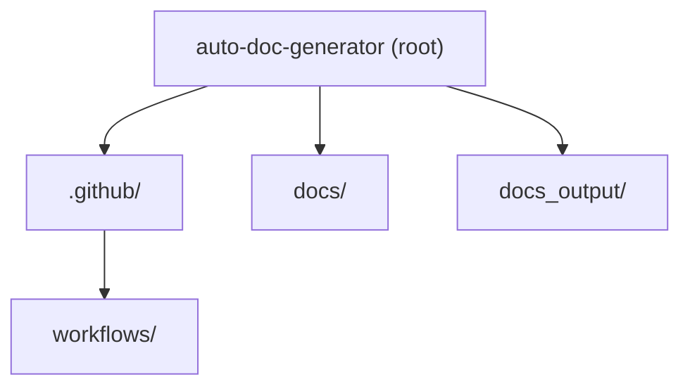

# Architecture Diagram – auto-doc-generator

> Auto-generated from the repository file tree.

## Directory Overview

| Directory | Purpose |
|-----------|---------|
| `.github/workflows/` | — |
| `docs/` | — |
| `docs_output/` | — |